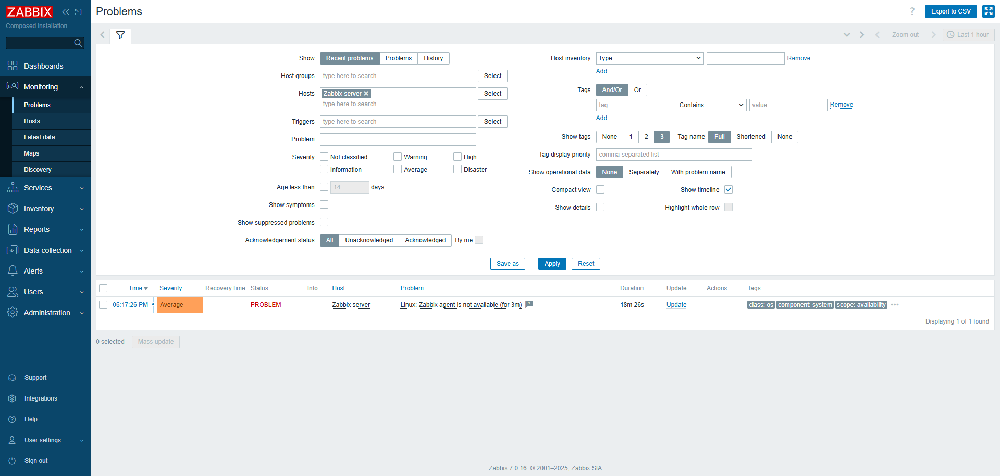

# Zabbix Agent diagnostics

## Цель

Настроить Zabbix Agent на VPS и подключить его к Zabbix Server, который работает в Docker.

## Схема

* Zabbix Server работает в Docker
* Zabbix Agent установлен на хостовой системе AlmaLinux
* Агент слушает порт 10050
* Zabbix Server опрашивает агент по IP VPS

## Проверка установленного агента

```bash
rpm -qa | grep zabbix-agent
systemctl status zabbix-agent --no-pager
```

## Основной конфигурационный файл

```bash
/etc/zabbix_agentd.conf
```

Проверка параметров:

```bash
grep -E "^Server=|^ServerActive=|^Hostname=" /etc/zabbix_agentd.conf
```

Финальная настройка:

```ini
Server=127.0.0.1,*
ServerActive=*
Hostname=Zabbix server
```

## Проверка агента

```bash
ss -tulpn | grep 10050
zabbix_get -s 127.0.0.1 -k "system.uptime"
zabbix_get -s * -k "system.uptime"
```

## Проверка из Docker контейнера Zabbix Server

```bash
docker exec -it zabbix-docker-zabbix-server-1 zabbix_get -s * -k "system.uptime"
```

## Диагностика ошибки доступа

В логах агента была ошибка:

```text
connection from "172.16.238.2" rejected, allowed hosts: "127.0.0.1,*"
```

Причина:

Zabbix Server работает в Docker и подключается к агенту с внутреннего IP Docker-сети.

Решение:

Добавить IP контейнера Zabbix Server в параметр `Server`:

```ini
Server=127.0.0.1,*
```

После изменения:

```bash
systemctl restart zabbix-agent
```

## Результат

Проблема:

```text
Linux: Zabbix agent is not available
```

Перешла в состояние:

```text
RESOLVED
```

Zabbix Server успешно получает данные от Zabbix Agent.

## Скриншоты

### Zabbix Agent недоступен



###  Проблема решена


